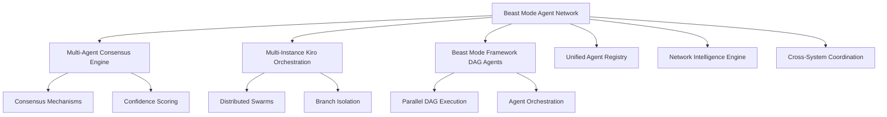

# Beast Mode Agent Network Design

## Overview

The Beast Mode Agent Network serves as the unified coordination layer that integrates and orchestrates all multi-agent operations across the Beast Mode ecosystem. It provides a systematic approach to managing distributed agent swarms, consensus mechanisms, and cross-system agent collaboration.

## Architecture

### Core Components

1. **Network Coordinator**: Central orchestration hub for all agent network operations
2. **Agent Registry**: Unified registry of all active agents across different systems
3. **Consensus Orchestrator**: Integration layer for Multi-Agent Consensus Engine
4. **Swarm Manager**: Integration layer for Multi-Instance Kiro Orchestration
5. **DAG Agent Coordinator**: Integration layer for Beast Mode Framework DAG agents
6. **Intelligence Engine**: Learning and optimization system for network performance

### System Integration Points



## Components and Interfaces

### Network Coordinator

**Purpose**: Central orchestration hub for all agent network operations

**Key Methods**:
- `coordinate_multi_system_agents()`: Orchestrate agents across different Beast Mode systems
- `optimize_agent_allocation()`: Distribute work optimally across available agents
- `handle_cross_system_conflicts()`: Resolve conflicts between different agent types
- `monitor_network_health()`: Track performance and health across all agent systems

### Agent Registry

**Purpose**: Unified registry and discovery service for all active agents

**Key Methods**:
- `register_agent()`: Register agents from any Beast Mode system
- `discover_agents()`: Find available agents by capability and system type
- `track_agent_performance()`: Monitor agent performance across all systems
- `manage_agent_lifecycle()`: Coordinate agent creation, execution, and termination

### Consensus Orchestrator

**Purpose**: Integration layer for Multi-Agent Consensus Engine operations

**Key Methods**:
- `integrate_consensus_engine()`: Connect with Multi-Agent Consensus Engine
- `coordinate_consensus_decisions()`: Orchestrate consensus across agent types
- `apply_confidence_scoring()`: Use consensus engine confidence scoring network-wide
- `escalate_complex_conflicts()`: Handle conflicts that require consensus mechanisms

### Swarm Manager

**Purpose**: Integration layer for Multi-Instance Kiro Orchestration

**Key Methods**:
- `integrate_kiro_orchestration()`: Connect with Multi-Instance Kiro Orchestration
- `coordinate_distributed_swarms()`: Manage swarms across deployment targets
- `handle_branch_coordination()`: Coordinate branch isolation and merging
- `optimize_swarm_composition()`: Determine optimal swarm size and composition

### DAG Agent Coordinator

**Purpose**: Integration layer for Beast Mode Framework DAG agents

**Key Methods**:
- `integrate_dag_agents()`: Connect with Beast Mode Framework DAG execution
- `coordinate_parallel_execution()`: Manage parallel DAG agent execution
- `handle_dag_dependencies()`: Ensure proper dependency management across agents
- `optimize_dag_performance()`: Optimize DAG execution across agent network

### Intelligence Engine

**Purpose**: Learning and optimization system for network performance

**Key Methods**:
- `learn_from_agent_patterns()`: Analyze success and failure patterns across all agents
- `optimize_coordination_strategies()`: Improve agent coordination based on learning
- `predict_optimal_allocation()`: Use ML to predict best agent allocation strategies
- `apply_systematic_improvement()`: Use PDCA methodology for network optimization

## Data Models

### AgentNetworkState

```python
@dataclass
class AgentNetworkState:
    active_agents: Dict[str, AgentInfo]
    system_integrations: Dict[str, SystemIntegration]
    performance_metrics: NetworkPerformanceMetrics
    coordination_status: CoordinationStatus
    intelligence_insights: IntelligenceInsights
```

### AgentInfo

```python
@dataclass
class AgentInfo:
    agent_id: str
    system_type: str  # consensus, orchestration, dag
    capabilities: List[str]
    current_status: AgentStatus
    performance_history: List[PerformanceMetric]
    resource_usage: ResourceUsage
```

### SystemIntegration

```python
@dataclass
class SystemIntegration:
    system_name: str
    integration_status: IntegrationStatus
    active_agents: List[str]
    coordination_overhead: float
    success_rate: float
```

## Error Handling

### Network-Level Error Handling

1. **Agent System Failures**: Graceful degradation when individual agent systems fail
2. **Coordination Conflicts**: Systematic resolution of conflicts between agent types
3. **Resource Exhaustion**: Intelligent load balancing and resource management
4. **Communication Failures**: Fallback mechanisms for inter-system communication
5. **Performance Degradation**: Automatic optimization and resource reallocation

### Recovery Strategies

1. **Systematic RCA**: Apply RCA methodology to all network-level failures
2. **Graceful Degradation**: Maintain core functionality even with partial system failures
3. **Automatic Recovery**: Self-healing mechanisms for common failure patterns
4. **Escalation Procedures**: Clear escalation paths for complex failures
5. **Learning Integration**: Learn from failures to prevent future occurrences

## Testing Strategy

### Unit Testing

- Test each component in isolation with mock integrations
- Validate error handling and edge cases for all components
- Test performance characteristics under various load conditions
- Verify systematic compliance and ReflectiveModule inheritance

### Integration Testing

- Test integration with Multi-Agent Consensus Engine
- Test integration with Multi-Instance Kiro Orchestration  
- Test integration with Beast Mode Framework DAG agents
- Test cross-system agent coordination and conflict resolution

### System Testing

- Test complete agent network under realistic workloads
- Validate performance requirements across all integrated systems
- Test failure scenarios and recovery mechanisms
- Verify systematic improvement and learning capabilities

### Performance Testing

- Load testing with 100+ concurrent agents across all systems
- Latency testing for <100ms coordination overhead
- Scalability testing across local, cloud, and hybrid deployments
- Efficiency testing for >80% theoretical maximum parallel speedup

## Security Considerations

### Authentication and Authorization

- Secure authentication for all agent-to-network communication
- Role-based access control for different agent types and capabilities
- Secure credential management across distributed deployments
- Audit logging for all network-level operations

### Communication Security

- Encrypted communication between network and all integrated systems
- Message integrity verification for all inter-system communication
- Secure handling of sensitive agent data and performance metrics
- Protection against agent impersonation and network attacks

## Deployment Architecture

### Local Deployment

- Single-node deployment for development and testing
- Integration with local instances of all agent systems
- Resource optimization for local development environments
- Development-friendly debugging and monitoring capabilities

### Cloud Deployment

- Distributed deployment across cloud infrastructure
- Auto-scaling based on agent workload and performance requirements
- Integration with cloud-native agent system deployments
- Production-grade monitoring, logging, and alerting

### Hybrid Deployment

- Coordination between local and cloud agent deployments
- Intelligent workload distribution based on resource availability
- Secure communication across hybrid infrastructure
- Unified monitoring and management across deployment targets