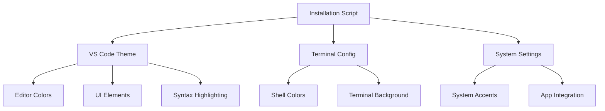

# Design Document - Change Window Color to Purple

## Overview

This design implements a comprehensive purple theming solution that transforms the visual appearance of development tools and system interfaces. The solution focuses on VS Code as the primary target, with additional terminal and system integration for a cohesive purple development environment.

## Architecture

The theming system consists of three main components:

1. **VS Code Theme Extension** - Custom color theme with purple palette
2. **Terminal Configuration** - Shell and terminal emulator color schemes  
3. **System Integration** - macOS accent colors and application theming



## Components and Interfaces

### VS Code Theme Extension

**Structure:**
- `package.json` - Extension manifest with theme metadata
- `themes/purple-theme.json` - Color definitions and token mappings
- `README.md` - Installation and usage documentation

**Key Interfaces:**
- VS Code Theme API for color token mapping
- Extension marketplace packaging format
- User settings integration

### Terminal Configuration

**Components:**
- Shell profile configuration (zsh/bash)
- Terminal emulator settings (Terminal.app, iTerm2)
- Color scheme files for popular terminals

**Integration Points:**
- Shell startup scripts (.zshrc, .bash_profile)
- Terminal application preferences
- ANSI color code mappings

### System Integration

**macOS Integration:**
- System Preferences accent color settings
- Application-specific theming where supported
- Third-party theming tools integration

## Data Models

### Color Palette Schema

```json
{
  "name": "Purple Development Theme",
  "type": "dark",
  "colors": {
    "editor.background": "#1A0D26",
    "editor.foreground": "#E6E6FA",
    "activityBar.background": "#2D1B3D",
    "sideBar.background": "#3D2A4F",
    "statusBar.background": "#8B008B"
  },
  "tokenColors": [
    {
      "scope": "keyword",
      "settings": {
        "foreground": "#9370DB"
      }
    }
  ]
}
```

### Terminal Color Configuration

```bash
# Purple terminal color scheme
export TERM_BACKGROUND="#1A0D26"
export TERM_FOREGROUND="#E6E6FA"
export TERM_ACCENT="#9370DB"
```

## Error Handling

### VS Code Theme Installation
- Validate VS Code installation before theme deployment
- Handle extension installation failures gracefully
- Provide fallback to manual installation instructions

### Terminal Configuration
- Detect terminal emulator type automatically
- Handle permission issues with profile modification
- Backup existing configurations before changes

### System Integration
- Check macOS version compatibility
- Handle system preference access restrictions
- Provide alternative methods for restricted environments

## Testing Strategy

### Automated Testing
- VS Code theme validation against color contrast standards
- Terminal color scheme verification across different shells
- Installation script testing on clean macOS environments

### Manual Testing
- Visual verification of purple theme consistency
- User experience testing for theme activation
- Cross-application color coordination validation

### Compatibility Testing
- Multiple VS Code versions
- Different terminal emulators (Terminal.app, iTerm2, Hyper)
- Various macOS versions (Big Sur, Monterey, Ventura, Sonoma)