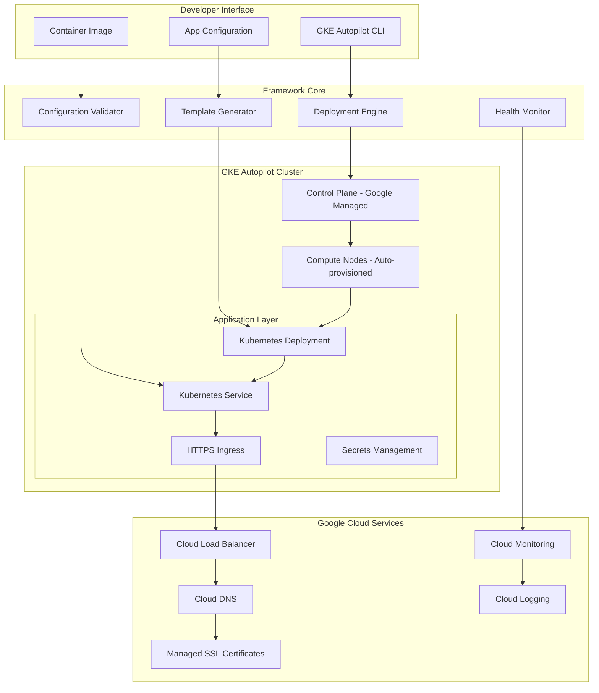

# GKE Autopilot Deployment Framework - Design Document

## Overview

The Universal GKE Autopilot Deployment Framework provides a systematic, production-ready approach to deploying any containerized application on Google Kubernetes Engine Autopilot. This framework eliminates infrastructure management complexity while providing full Kubernetes capabilities, automatic scaling, and cost optimization.

The design emphasizes hackathon velocity with production-grade reliability, enabling rapid deployment demonstrations while maintaining enterprise-level quality standards.

## Architecture

### System Architecture



### Component Architecture

#### 1. Deployment Engine
- **Cluster Management**: Automatic GKE Autopilot cluster creation and configuration
- **Application Deployment**: Kubernetes resource generation and deployment
- **Scaling Configuration**: Horizontal Pod Autoscaler and Vertical Pod Autoscaler setup
- **Network Configuration**: Service mesh and ingress configuration

#### 2. Template Generator
- **Kubernetes Manifests**: Dynamic generation based on application requirements
- **Configuration Management**: Environment-specific configuration injection
- **Security Policies**: Automatic security best practices application
- **Resource Optimization**: Autopilot-optimized resource requests and limits

#### 3. Configuration Validator
- **Input Validation**: Application configuration and container image validation
- **Compatibility Checks**: GKE Autopilot compatibility verification
- **Security Scanning**: Container image security analysis
- **Resource Planning**: Cost and performance estimation

#### 4. Health Monitor
- **Deployment Status**: Real-time deployment progress tracking
- **Application Health**: Continuous health check monitoring
- **Performance Metrics**: Application and infrastructure metrics collection
- **Alerting**: Automated issue detection and notification

## Components and Interfaces

### Core Components

#### GKE Autopilot Manager
```python
class GKEAutopilotManager:
    """Main orchestrator for GKE Autopilot deployments"""
    
    async def deploy_application(self, config: AppConfig) -> DeploymentResult
    async def create_cluster(self, cluster_config: ClusterConfig) -> Cluster
    async def update_application(self, app_name: str, config: AppConfig) -> UpdateResult
    async def delete_application(self, app_name: str) -> DeletionResult
    async def get_deployment_status(self, app_name: str) -> DeploymentStatus
```

#### Application Configuration
```python
@dataclass
class AppConfig:
    name: str
    image: str
    port: int
    environment_variables: Dict[str, str]
    resource_requests: ResourceRequests
    scaling_config: ScalingConfig
    health_checks: HealthCheckConfig
    ingress_config: IngressConfig
```

#### Cluster Configuration
```python
@dataclass
class ClusterConfig:
    name: str
    region: str
    network_config: NetworkConfig
    security_config: SecurityConfig
    monitoring_config: MonitoringConfig
    cost_optimization: CostOptimizationConfig
```

### Interface Specifications

#### CLI Interface
```bash
# Deploy application
gke-autopilot deploy --config app.yaml --image gcr.io/project/app:latest

# Create cluster
gke-autopilot cluster create --name my-cluster --region us-central1

# Get status
gke-autopilot status --app my-app

# Scale application
gke-autopilot scale --app my-app --replicas 5

# Update application
gke-autopilot update --app my-app --image gcr.io/project/app:v2

# Delete application
gke-autopilot delete --app my-app
```

#### Configuration File Format
```yaml
# app-config.yaml
apiVersion: gke-autopilot/v1
kind: ApplicationConfig
metadata:
  name: my-hackathon-app
spec:
  image: gcr.io/my-project/my-app:latest
  port: 8080
  environment:
    - name: ENV
      value: production
    - name: DATABASE_URL
      valueFrom:
        secretKeyRef:
          name: db-secret
          key: url
  resources:
    requests:
      cpu: 100m
      memory: 256Mi
  scaling:
    minReplicas: 1
    maxReplicas: 10
    targetCPUUtilization: 70
  healthChecks:
    readiness:
      path: /health
      port: 8080
    liveness:
      path: /health
      port: 8080
  ingress:
    enabled: true
    domain: my-app.example.com
    tls: true
```

## Data Models

### Core Data Structures

#### Deployment Models
```python
@dataclass
class DeploymentResult:
    success: bool
    cluster_name: str
    application_url: str
    deployment_time: datetime
    resource_usage: ResourceUsage
    cost_estimate: CostEstimate
    monitoring_dashboard: str

@dataclass
class ResourceUsage:
    cpu_cores: float
    memory_gb: float
    storage_gb: float
    network_gb: float

@dataclass
class CostEstimate:
    hourly_cost: float
    daily_cost: float
    monthly_cost: float
    cost_breakdown: Dict[str, float]
```

#### Monitoring Models
```python
@dataclass
class DeploymentStatus:
    phase: DeploymentPhase
    ready_replicas: int
    total_replicas: int
    conditions: List[DeploymentCondition]
    events: List[KubernetesEvent]
    metrics: ApplicationMetrics

@dataclass
class ApplicationMetrics:
    cpu_usage: float
    memory_usage: float
    request_rate: float
    error_rate: float
    response_time: float
```

### Configuration Models

#### Scaling Configuration
```python
@dataclass
class ScalingConfig:
    min_replicas: int = 1
    max_replicas: int = 10
    target_cpu_utilization: int = 70
    target_memory_utilization: int = 80
    scale_up_stabilization: int = 60
    scale_down_stabilization: int = 300
```

#### Security Configuration
```python
@dataclass
class SecurityConfig:
    enable_workload_identity: bool = True
    enable_network_policy: bool = True
    enable_pod_security_policy: bool = True
    service_account: Optional[str] = None
    secrets: List[SecretConfig] = field(default_factory=list)
```

## Error Handling

### Error Categories

1. **Configuration Errors**: Invalid application configuration or missing required fields
2. **Infrastructure Errors**: GKE cluster creation or networking issues
3. **Deployment Errors**: Kubernetes resource creation or application startup failures
4. **Runtime Errors**: Application health check failures or resource constraints
5. **Network Errors**: Ingress configuration or DNS resolution issues

### Error Handling Strategies

#### Validation Pipeline
```python
class ConfigurationValidator:
    def validate_app_config(self, config: AppConfig) -> ValidationResult:
        """Comprehensive configuration validation"""
        
    def validate_cluster_requirements(self, config: AppConfig) -> ClusterRequirements:
        """Determine optimal cluster configuration"""
        
    def estimate_costs(self, config: AppConfig) -> CostEstimate:
        """Provide cost estimates before deployment"""
```

#### Retry Logic
- **Exponential Backoff**: For transient infrastructure failures
- **Circuit Breaker**: For persistent service failures
- **Graceful Degradation**: Fallback to basic configurations when advanced features fail

#### Recovery Mechanisms
- **Automatic Rollback**: On deployment failures
- **Health-based Recovery**: Automatic restart of unhealthy pods
- **Resource Adjustment**: Dynamic resource allocation based on usage patterns

## Testing Strategy

### Testing Levels

#### Unit Tests
- Configuration validation logic
- Template generation functions
- Resource calculation algorithms
- Error handling scenarios

#### Integration Tests
- GKE API integration
- Kubernetes resource creation
- Application deployment workflows
- Monitoring and logging integration

#### End-to-End Tests
- Complete deployment scenarios
- Multi-application deployments
- Scaling and update operations
- Disaster recovery procedures

#### Performance Tests
- Deployment speed benchmarks
- Resource utilization optimization
- Cost efficiency validation
- Scalability limits testing

### Test Scenarios

#### Hackathon Scenarios
1. **Rapid Deployment**: Deploy demo application in under 5 minutes
2. **Live Scaling**: Demonstrate auto-scaling during load spikes
3. **Zero Downtime Updates**: Rolling updates without service interruption
4. **Cost Optimization**: Show cost savings compared to traditional deployments

#### Production Scenarios
1. **High Availability**: Multi-zone deployment with automatic failover
2. **Security Compliance**: Full security scanning and policy enforcement
3. **Monitoring Integration**: Complete observability stack deployment
4. **Disaster Recovery**: Backup and restore procedures

## Deployment Considerations

### GKE Autopilot Optimization

#### Resource Configuration
- **CPU Requests**: Optimized for Autopilot's CPU allocation model
- **Memory Requests**: Aligned with Autopilot's memory tiers
- **Storage**: Efficient persistent volume configuration
- **Network**: Optimized for Autopilot's network architecture

#### Cost Optimization
- **Right-sizing**: Automatic resource request optimization
- **Spot Instances**: Intelligent use of preemptible nodes where appropriate
- **Scaling Policies**: Cost-aware scaling configurations
- **Resource Monitoring**: Continuous cost optimization recommendations

### Security Best Practices

#### Workload Identity
- Automatic Google Cloud service account binding
- Least privilege access principles
- Secure secret management integration

#### Network Security
- Private cluster configuration
- Network policy enforcement
- Ingress security controls
- TLS termination and certificate management

### Monitoring and Observability

#### Metrics Collection
- **Application Metrics**: Custom application metrics integration
- **Infrastructure Metrics**: GKE and node-level metrics
- **Business Metrics**: Request rates, error rates, and performance indicators
- **Cost Metrics**: Real-time cost tracking and optimization alerts

#### Logging Strategy
- **Structured Logging**: JSON-formatted logs for easy parsing
- **Log Aggregation**: Centralized logging with Cloud Logging
- **Log Analysis**: Automated log analysis and alerting
- **Audit Logging**: Complete audit trail for compliance

#### Alerting Framework
- **Proactive Alerts**: Predictive alerting based on trends
- **Escalation Policies**: Multi-level alert escalation
- **Integration**: Slack, email, and webhook integrations
- **Runbook Automation**: Automated response to common issues

## Scalability and Performance

### Horizontal Scaling
- **Pod Autoscaling**: CPU and memory-based scaling
- **Custom Metrics**: Application-specific scaling triggers
- **Predictive Scaling**: Machine learning-based scaling predictions
- **Multi-dimensional Scaling**: Combined CPU, memory, and custom metrics

### Vertical Scaling
- **Vertical Pod Autoscaler**: Automatic resource request optimization
- **Resource Recommendations**: Continuous optimization suggestions
- **Performance Profiling**: Application performance analysis
- **Cost-Performance Balance**: Optimal resource allocation

### Global Scaling
- **Multi-region Deployment**: Global application distribution
- **Traffic Routing**: Intelligent traffic distribution
- **Data Locality**: Region-aware data placement
- **Disaster Recovery**: Cross-region backup and recovery

## Integration Points

### CI/CD Integration
- **GitHub Actions**: Automated deployment workflows
- **Cloud Build**: Google Cloud native CI/CD
- **GitOps**: Git-based deployment management
- **Artifact Registry**: Container image management

### Development Tools
- **Skaffold**: Local development workflow
- **Helm**: Package management integration
- **Kustomize**: Configuration management
- **Telepresence**: Local development against remote clusters

### Monitoring Tools
- **Prometheus**: Metrics collection and alerting
- **Grafana**: Visualization and dashboards
- **Jaeger**: Distributed tracing
- **Cloud Monitoring**: Google Cloud native monitoring

This design provides a comprehensive, production-ready framework for GKE Autopilot deployments while maintaining the simplicity and speed required for hackathon demonstrations. The architecture emphasizes automation, cost optimization, and developer experience while ensuring enterprise-grade reliability and security.