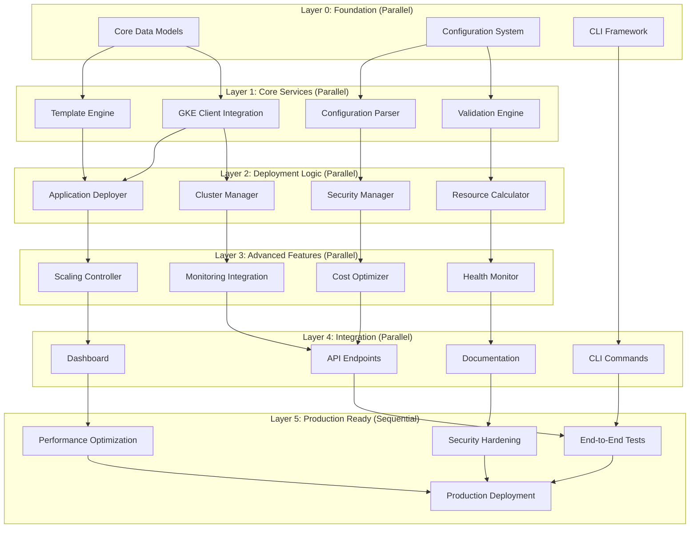

# GKE Autopilot Deployment Framework - Implementation Tasks

## DAG-Optimized Task Structure

This implementation plan is structured as a Directed Acyclic Graph (DAG) to enable maximum parallel execution while maintaining systematic dependencies. Tasks are grouped into parallel execution layers for optimal development velocity.

## Task Dependency Graph

## Implementation Tasks

### Layer 0: Foundation (No Dependencies - Execute in Parallel)

- [x] **FOUNDATION-1: Core Data Models**
  - Create AppConfig, ClusterConfig, and DeploymentResult data classes
  - Implement serialization/deserialization for YAML and JSON formats
  - Add comprehensive validation methods with detailed error messages
  - Write unit tests for all data model operations and edge cases
  - **Dependencies:** None
  - **Parallel Group:** Foundation
  - _Requirements: R1.1, R1.2, R8.1, R8.2_

- [x] **FOUNDATION-2: Configuration System**
  - Implement configuration file parsing with schema validation
  - Create environment variable override system for deployment flexibility
  - Add configuration templating system for multi-environment deployments
  - Write comprehensive tests for configuration scenarios and error handling
  - **Dependencies:** None
  - **Parallel Group:** Foundation
  - _Requirements: R8.1, R8.2, R8.3, R9.1_

- [x] **FOUNDATION-3: CLI Framework Setup**
  - Set up Click-based CLI framework with command structure
  - Implement global options, logging, and error handling infrastructure
  - Create progress indicators and user feedback systems
  - Add CLI testing framework and basic command tests
  - **Dependencies:** None
  - **Parallel Group:** Foundation
  - _Requirements: R9.1, R9.2, R9.3, R9.4_

### Layer 1: Core Services (Depends on Foundation)

- [x] **CORE-1: GKE Client Integration**
  - Implement Google Cloud client authentication and project setup
  - Create GKE Autopilot cluster management operations (create, update, delete)
  - Add Kubernetes client integration for resource management
  - Write integration tests with mock GKE API responses
  - **Dependencies:** FOUNDATION-1, FOUNDATION-2
  - **Parallel Group:** Core-Services
  - _Requirements: R1.1, R1.2, R3.1, R3.2_

- [x] **CORE-2: Template Engine**
  - Create Kubernetes manifest template system with Jinja2
  - Implement dynamic resource generation based on application requirements
  - Add GKE Autopilot-specific optimizations and best practices
  - Write template validation and generation tests
  - **Dependencies:** FOUNDATION-1, FOUNDATION-2
  - **Parallel Group:** Core-Services
  - _Requirements: R1.2, R1.3, R2.1, R2.2_

- [x] **CORE-3: Validation Engine**
  - Implement application configuration validation with detailed feedback
  - Create container image validation and security scanning integration
  - Add GKE Autopilot compatibility checks and recommendations
  - Write comprehensive validation test suite with edge cases
  - **Dependencies:** FOUNDATION-1, FOUNDATION-2
  - **Parallel Group:** Core-Services
  - _Requirements: R1.1, R1.2, R6.1, R6.2_

- [ ] **CORE-4: Configuration Parser**
  - Create YAML/JSON configuration file parser with schema validation
  - Implement configuration merging and override system
  - Add configuration validation with helpful error messages
  - Write parser tests with various configuration scenarios
  - **Dependencies:** FOUNDATION-1, FOUNDATION-2
  - **Parallel Group:** Core-Services
  - _Requirements: R8.1, R8.2, R9.1, R9.2_

### Layer 2: Deployment Logic (Depends on Core Services)

- [x] **DEPLOY-1: Cluster Manager**
  - Implement GKE Autopilot cluster creation with optimal configuration
  - Add cluster health monitoring and status reporting
  - Create cluster update and maintenance operations
  - Write cluster management tests with various scenarios
  - **Dependencies:** CORE-1, CORE-3
  - **Parallel Group:** Deployment-Logic
  - _Requirements: R1.1, R1.2, R3.1, R3.2_

- [x] **DEPLOY-2: Application Deployer**
  - Create Kubernetes application deployment orchestration
  - Implement rolling updates with zero-downtime deployment strategies
  - Add deployment rollback and recovery mechanisms
  - Write deployment tests with success and failure scenarios
  - **Dependencies:** CORE-1, CORE-2
  - **Parallel Group:** Deployment-Logic
  - _Requirements: R1.2, R1.3, R1.4, R6.3_

- [ ] **DEPLOY-3: Resource Calculator**
  - Implement GKE Autopilot resource optimization algorithms
  - Create cost estimation and resource planning tools
  - Add performance prediction based on application requirements
  - Write resource calculation tests with various workload patterns
  - **Dependencies:** CORE-2, CORE-3
  - **Parallel Group:** Deployment-Logic
  - _Requirements: R2.1, R2.2, R2.3, R2.4_

- [ ] **DEPLOY-4: Security Manager**
  - Implement Workload Identity and service account management
  - Create network security policies and ingress configuration
  - Add secrets management and encryption at rest
  - Write security tests and compliance validation
  - **Dependencies:** CORE-1, CORE-4
  - **Parallel Group:** Deployment-Logic
  - _Requirements: R6.1, R6.2, R6.3, R6.4_

### Layer 3: Advanced Features (Depends on Deployment Logic)

- [ ] **ADVANCED-1: Monitoring Integration**
  - Integrate Google Cloud Monitoring and Logging services
  - Create custom metrics collection and dashboard generation
  - Implement alerting rules and notification systems
  - Write monitoring integration tests and metric validation
  - **Dependencies:** DEPLOY-1, DEPLOY-2
  - **Parallel Group:** Advanced-Features
  - _Requirements: R4.1, R4.2, R4.3, R4.4_

- [ ] **ADVANCED-2: Scaling Controller**
  - Implement Horizontal Pod Autoscaler configuration
  - Create Vertical Pod Autoscaler integration for resource optimization
  - Add custom metrics-based scaling policies
  - Write scaling tests with load simulation and validation
  - **Dependencies:** DEPLOY-2, DEPLOY-3
  - **Parallel Group:** Advanced-Features
  - _Requirements: R2.1, R2.2, R2.5, R2.6_

- [ ] **ADVANCED-3: Health Monitor**
  - Create application health check configuration and monitoring
  - Implement readiness and liveness probe optimization
  - Add deployment status tracking and progress reporting
  - Write health monitoring tests with various failure scenarios
  - **Dependencies:** DEPLOY-2, DEPLOY-4
  - **Parallel Group:** Advanced-Features
  - _Requirements: R6.1, R6.2, R6.3, R6.4_

- [ ] **ADVANCED-4: Cost Optimizer**
  - Implement real-time cost tracking and optimization recommendations
  - Create resource usage analysis and right-sizing suggestions
  - Add cost alerting and budget management features
  - Write cost optimization tests with usage pattern analysis
  - **Dependencies:** DEPLOY-3, ADVANCED-1
  - **Parallel Group:** Advanced-Features
  - _Requirements: R2.3, R2.4, R2.5, R2.6_

### Layer 4: Integration (Depends on Advanced Features)

- [x] **INTEGRATION-1: CLI Commands**
  - Implement complete CLI command set (deploy, status, scale, update, delete)
  - Add interactive deployment wizard for guided setup
  - Create command aliases and shortcuts for common operations
  - Write comprehensive CLI tests with user interaction simulation
  - **Dependencies:** FOUNDATION-3, ADVANCED-1, ADVANCED-2
  - **Parallel Group:** Integration-Layer
  - _Requirements: R9.1, R9.2, R9.3, R9.4_

- [ ] **INTEGRATION-2: API Endpoints**
  - Create REST API for programmatic access to all deployment operations
  - Implement API authentication and authorization
  - Add API documentation with OpenAPI/Swagger specification
  - Write API integration tests with various client scenarios
  - **Dependencies:** ADVANCED-1, ADVANCED-3
  - **Parallel Group:** Integration-Layer
  - _Requirements: R7.1, R7.2, R7.3, R7.4_

- [ ] **INTEGRATION-3: Web Dashboard**
  - Create web-based dashboard for deployment visualization
  - Implement real-time status updates and metrics display
  - Add deployment management interface with drag-and-drop configuration
  - Write dashboard tests with UI automation and user experience validation
  - **Dependencies:** ADVANCED-2, ADVANCED-4
  - **Parallel Group:** Integration-Layer
  - _Requirements: R5.1, R5.2, R5.3, R5.4_

- [ ] **INTEGRATION-4: Documentation and Examples**
  - Create comprehensive user documentation with tutorials
  - Implement example applications and deployment scenarios
  - Add troubleshooting guides and best practices documentation
  - Write documentation tests and example validation
  - **Dependencies:** ADVANCED-3, ADVANCED-4
  - **Parallel Group:** Integration-Layer
  - _Requirements: R9.5, R9.6_

### Layer 5: Production Ready (Sequential Dependencies)

- [ ] **PRODUCTION-1: End-to-End Test Suite**
  - Create comprehensive end-to-end tests for all deployment scenarios
  - Implement performance benchmarking and load testing
  - Add chaos engineering tests for resilience validation
  - Write test automation and continuous integration setup
  - **Dependencies:** INTEGRATION-1, INTEGRATION-2
  - **Sequential Group:** Production-Ready
  - _Requirements: All requirements validation_

- [ ] **PRODUCTION-2: Performance Optimization**
  - Optimize deployment speed and resource utilization
  - Implement caching and parallel processing optimizations
  - Add performance monitoring and bottleneck identification
  - Write performance regression tests and benchmarking
  - **Dependencies:** PRODUCTION-1
  - **Sequential Group:** Production-Ready
  - _Requirements: R5.1, R5.2, R5.3_

- [ ] **PRODUCTION-3: Security Hardening**
  - Implement comprehensive security scanning and validation
  - Add penetration testing and vulnerability assessment
  - Create security compliance reporting and audit trails
  - Write security tests and compliance validation
  - **Dependencies:** PRODUCTION-2
  - **Sequential Group:** Production-Ready
  - _Requirements: R6.1, R6.2, R6.3, R6.4, R6.5_

- [ ] **PRODUCTION-4: Production Deployment Package**
  - Create production deployment scripts and automation
  - Implement monitoring and alerting for production environments
  - Add backup and disaster recovery procedures
  - Write production readiness checklist and validation
  - **Dependencies:** PRODUCTION-3
  - **Sequential Group:** Production-Ready
  - _Requirements: All requirements final validation_

## Parallel Execution Strategy

### Maximum Parallelism Opportunities

**Layer 0 (3 parallel tasks):** FOUNDATION-1, FOUNDATION-2, FOUNDATION-3
**Layer 1 (4 parallel tasks):** CORE-1, CORE-2, CORE-3, CORE-4
**Layer 2 (4 parallel tasks):** DEPLOY-1, DEPLOY-2, DEPLOY-3, DEPLOY-4
**Layer 3 (4 parallel tasks):** ADVANCED-1, ADVANCED-2, ADVANCED-3, ADVANCED-4
**Layer 4 (4 parallel tasks):** INTEGRATION-1, INTEGRATION-2, INTEGRATION-3, INTEGRATION-4
**Layer 5 (4 sequential tasks):** PRODUCTION-1 → PRODUCTION-2 → PRODUCTION-3 → PRODUCTION-4

### Critical Path Analysis

**Shortest Path to MVP:** Foundation → Core Services → Deployment Logic → CLI Commands → Basic Testing
**Estimated Timeline:** 
- Layer 0: 2-3 hours (parallel)
- Layer 1: 3-4 hours (parallel)
- Layer 2: 4-5 hours (parallel)
- Layer 3: 3-4 hours (parallel)
- Layer 4: 2-3 hours (parallel)
- Layer 5: 4-6 hours (sequential)

**Total Estimated Time:** 18-25 hours with maximum parallelization

### Resource Allocation Strategy

**High Priority Parallel Tracks:**
1. **Track A:** FOUNDATION-1 → CORE-1 → DEPLOY-1 → ADVANCED-1 → INTEGRATION-1
2. **Track B:** FOUNDATION-2 → CORE-2 → DEPLOY-2 → ADVANCED-2 → INTEGRATION-2
3. **Track C:** FOUNDATION-3 → CORE-3 → DEPLOY-3 → ADVANCED-3 → INTEGRATION-3

**Optimization Notes:**
- Each layer can be executed in parallel once dependencies are satisfied
- Foundation layer has no dependencies - start all 3 tasks immediately
- Core Services layer can start as soon as Foundation tasks complete
- Maximum of 4 parallel tasks per layer for optimal resource utilization
- Production layer requires sequential execution for quality assurance

This DAG structure enables maximum development velocity while maintaining systematic quality and ensuring all dependencies are properly managed.