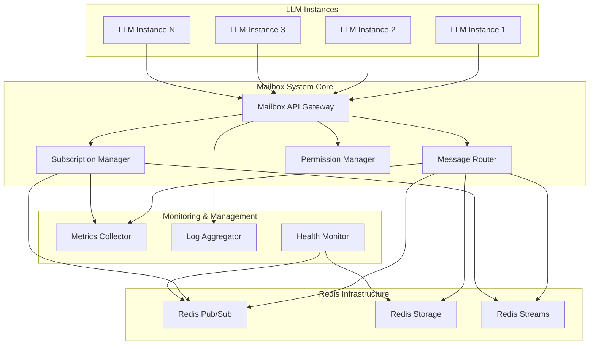

# Design Document

## Overview

The Inter-LLM Mailbox System is a distributed messaging infrastructure that enables asynchronous communication between Large Language Model instances using Redis as the underlying pub/sub and storage engine. The system implements a hybrid architecture combining real-time pub/sub messaging with persistent mailbox storage, ensuring both immediate delivery for active subscribers and reliable store-and-forward capabilities for offline participants.

The architecture supports multiple communication patterns including direct messaging, broadcast communication, topic-based group messaging, and hierarchical topic structures. Security is enforced through Redis ACLs and application-level permission management, while observability is provided through comprehensive metrics and logging.

## Architecture

### High-Level Architecture



### Component Architecture

The system consists of four primary layers:

1. **Client Layer**: LLM instances connect through standardized client libraries
2. **API Layer**: RESTful and WebSocket APIs for message operations
3. **Core Layer**: Message routing, subscription management, and permission enforcement
4. **Storage Layer**: Redis-based persistence and pub/sub infrastructure

## Components and Interfaces

### Mailbox API Gateway

**Purpose**: Provides unified access point for all LLM instances to interact with the mailbox system.

**Key Responsibilities**:
- Authentication and authorization of LLM instances
- Request routing to appropriate core components
- Rate limiting and quota enforcement
- Protocol translation (REST/WebSocket to internal APIs)

**Interfaces**:
```python
class MailboxAPIGateway:
    def authenticate_llm(self, credentials: LLMCredentials) -> AuthToken
    def send_message(self, token: AuthToken, message: Message) -> MessageID
    def subscribe_mailbox(self, token: AuthToken, mailbox: str) -> SubscriptionID
    def get_messages(self, token: AuthToken, mailbox: str, filters: MessageFilters) -> List[Message]
    def create_topic(self, token: AuthToken, topic: TopicConfig) -> TopicID
```

### Message Router

**Purpose**: Handles message delivery logic, routing, and persistence decisions.

**Key Responsibilities**:
- Message validation and enrichment
- Routing decisions based on addressing modes
- Persistence strategy selection
- Delivery confirmation tracking

**Interfaces**:
```python
class MessageRouter:
    def route_message(self, message: Message, routing_info: RoutingInfo) -> RoutingResult
    def validate_message(self, message: Message) -> ValidationResult
    def enrich_message(self, message: Message, sender_info: SenderInfo) -> EnrichedMessage
    def handle_delivery_confirmation(self, message_id: MessageID, status: DeliveryStatus)
```

### Subscription Manager

**Purpose**: Manages LLM subscriptions to mailboxes and topics, handles connection lifecycle.

**Key Responsibilities**:
- Subscription lifecycle management
- Connection state tracking
- Message delivery coordination
- Reconnection and recovery handling

**Interfaces**:
```python
class SubscriptionManager:
    def create_subscription(self, llm_id: LLMID, target: str, options: SubscriptionOptions) -> Subscription
    def remove_subscription(self, subscription_id: SubscriptionID) -> bool
    def get_active_subscriptions(self, llm_id: LLMID) -> List[Subscription]
    def handle_connection_loss(self, llm_id: LLMID)
    def deliver_message(self, message: Message, subscribers: List[LLMID])
```

### Permission Manager

**Purpose**: Enforces access controls and security policies for mailbox operations.

**Key Responsibilities**:
- ACL management and enforcement
- Role-based permission evaluation
- Security audit logging
- Dynamic permission updates

**Interfaces**:
```python
class PermissionManager:
    def check_permission(self, llm_id: LLMID, operation: Operation, resource: str) -> bool
    def grant_permission(self, llm_id: LLMID, permission: Permission) -> bool
    def revoke_permission(self, llm_id: LLMID, permission: Permission) -> bool
    def get_permissions(self, llm_id: LLMID) -> List[Permission]
    def audit_access(self, llm_id: LLMID, operation: Operation, resource: str, result: bool)
```

## Data Models

### Core Message Structure

```python
@dataclass
class Message:
    id: MessageID
    sender_id: LLMID
    timestamp: datetime
    content_type: ContentType
    payload: bytes
    metadata: Dict[str, Any]
    routing_info: RoutingInfo
    delivery_options: DeliveryOptions

@dataclass
class RoutingInfo:
    addressing_mode: AddressingMode  # DIRECT, BROADCAST, TOPIC
    target: str  # mailbox name or topic
    priority: Priority
    ttl: Optional[int]

@dataclass
class DeliveryOptions:
    persistence: bool
    confirmation_required: bool
    retry_policy: RetryPolicy
    encryption: Optional[EncryptionConfig]
```

### Subscription Model

```python
@dataclass
class Subscription:
    id: SubscriptionID
    llm_id: LLMID
    target: str
    pattern: Optional[str]  # for pattern-based subscriptions
    created_at: datetime
    last_activity: datetime
    options: SubscriptionOptions

@dataclass
class SubscriptionOptions:
    delivery_mode: DeliveryMode  # REALTIME, BATCH, POLLING
    message_filter: Optional[MessageFilter]
    max_queue_size: int
    auto_ack: bool
```

### Mailbox Storage Schema

**Redis Key Patterns**:
- `mailbox:{name}:messages` - Sorted set of messages by timestamp
- `mailbox:{name}:subscribers` - Set of active subscriber IDs
- `mailbox:{name}:metadata` - Hash of mailbox configuration
- `topic:{name}:subscribers` - Set of topic subscribers
- `llm:{id}:subscriptions` - Set of subscription IDs for an LLM
- `message:{id}` - Hash containing full message data

## Error Handling

### Error Categories

1. **Connection Errors**: Redis unavailability, network partitions
2. **Authentication Errors**: Invalid credentials, expired tokens
3. **Permission Errors**: Unauthorized access attempts
4. **Validation Errors**: Malformed messages, invalid parameters
5. **Resource Errors**: Quota exceeded, storage limits
6. **Delivery Errors**: Subscriber unavailable, message too large

### Error Handling Strategies

**Circuit Breaker Pattern**: Implemented for Redis connections with configurable failure thresholds and recovery timeouts.

**Retry Logic**: Exponential backoff with jitter for transient failures:
```python
class RetryPolicy:
    max_attempts: int = 3
    base_delay: float = 1.0
    max_delay: float = 60.0
    exponential_base: float = 2.0
    jitter: bool = True
```

**Graceful Degradation**: When Redis is unavailable:
- Queue messages locally with configurable limits
- Return cached subscription data
- Provide read-only access to recently cached messages

**Dead Letter Handling**: Messages that fail delivery after all retries are moved to dead letter queues for manual inspection.

## Testing Strategy

### Unit Testing

**Component Isolation**: Each core component tested independently with mocked dependencies.

**Test Coverage Areas**:
- Message validation and routing logic
- Permission evaluation algorithms
- Subscription lifecycle management
- Error handling and recovery scenarios

### Integration Testing

**Redis Integration**: Test suite using Redis test containers to verify:
- Pub/sub message delivery
- Data persistence and retrieval
- Connection handling and recovery
- Performance under load

**Multi-LLM Scenarios**: Automated tests simulating multiple LLM instances:
- Concurrent message sending and receiving
- Subscription management with multiple subscribers
- Topic-based communication patterns
- Permission enforcement across instances

### Performance Testing

**Load Testing**: Simulate high-volume message traffic:
- Message throughput benchmarks
- Subscription scalability limits
- Memory usage under sustained load
- Latency measurements for different message sizes

**Chaos Testing**: Introduce failures to test resilience:
- Redis connection drops
- Network partitions
- Subscriber failures
- Message corruption scenarios

### Security Testing

**Authentication Testing**: Verify credential validation and token management.

**Authorization Testing**: Confirm permission enforcement across all operations.

**Data Security**: Test message encryption and secure transmission.

**Audit Testing**: Verify comprehensive logging of security-relevant events.

## Deployment Considerations

### Redis Configuration

**High Availability**: Redis Sentinel or Cluster mode for production deployments.

**Persistence**: Configure both RDB snapshots and AOF logging for data durability.

**Memory Management**: Set appropriate maxmemory policies and eviction strategies.

**Security**: Enable AUTH, configure TLS, and set up network security groups.

### Scaling Strategy

**Horizontal Scaling**: Multiple API Gateway instances behind load balancer.

**Redis Sharding**: Partition mailboxes across Redis instances based on naming patterns.

**Connection Pooling**: Efficient Redis connection management to handle many LLM instances.

### Monitoring and Observability

**Metrics Collection**:
- Message throughput and latency
- Subscription counts and activity
- Error rates and types
- Resource utilization

**Alerting**:
- Redis connectivity issues
- High error rates
- Performance degradation
- Security violations

**Distributed Tracing**: Track message flow across system components for debugging and optimization.