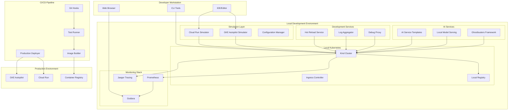

# Design Document

## Overview

The Local GKE Development Environment is a comprehensive development platform that provides production-parity simulation of Google Cloud Run and GKE Autopilot locally. The system enables developers to build, test, and deploy AI microservices with the same behavior and APIs as production Google Cloud services, while maintaining rapid development cycles and eliminating cloud costs during development.

The architecture leverages containerization, local Kubernetes orchestration, and intelligent simulation layers to provide an authentic cloud-native development experience. The system integrates seamlessly with existing CI/CD pipelines and provides automated deployment paths to production GKE clusters.

## Architecture

### High-Level Architecture



### Core Components

#### 1. Simulation Layer
- **Cloud Run Simulator**: Mimics Cloud Run's serverless behavior, scaling, and cold start patterns
- **GKE Autopilot Simulator**: Simulates node provisioning, resource optimization, and scheduling decisions
- **Configuration Manager**: Manages environment parity and configuration injection

#### 2. Local Kubernetes Infrastructure
- **Kind Cluster**: Lightweight Kubernetes cluster for local development
- **Ingress Controller**: Routes traffic and simulates load balancer behavior
- **Local Registry**: Stores container images locally for fast iteration

#### 3. Development Services
- **Hot Reload Service**: Monitors code changes and triggers automatic rebuilds/redeployments
- **Log Aggregator**: Collects and formats logs from all services
- **Debug Proxy**: Enables debugging capabilities with breakpoint support

#### 4. AI Services Integration
- **AI Service Templates**: FastAPI templates optimized for AI microservices
- **Local Model Serving**: Serves AI models locally with GPU support
- **Ghostbusters Framework**: Integrated AI agent framework for multi-agent systems

#### 5. Monitoring and Observability
- **Prometheus**: Metrics collection and storage
- **Grafana**: Visualization and dashboards
- **Jaeger**: Distributed tracing for microservices

## Components and Interfaces

### 1. Local Development CLI

**Interface**: Command-line interface for managing the local environment

**Key Methods**:
- `gke-local init` - Initialize local environment
- `gke-local start` - Start all services
- `gke-local deploy <service>` - Deploy service locally
- `gke-local logs <service>` - View service logs
- `gke-local debug <service>` - Enable debugging for service

**Configuration**:
```yaml
# gke-local.yaml
cluster:
  name: "local-gke-dev"
  kubernetes_version: "1.28"
  nodes: 3
  
simulation:
  cloud_run:
    enabled: true
    scale_to_zero: true
    cold_start_delay: "2s"
  
  autopilot:
    enabled: true
    node_auto_provisioning: true
    resource_optimization: true

services:
  monitoring:
    prometheus: true
    grafana: true
    jaeger: true
  
  ai:
    model_serving: true
    ghostbusters: true
    gpu_support: false
```

### 2. Cloud Run Simulator

**Interface**: HTTP API that mimics Cloud Run behavior

**Key Features**:
- Automatic scaling from 0 to N instances
- Cold start simulation with configurable delays
- Concurrency limit enforcement
- Request routing and load balancing

**Implementation**:
```python
class CloudRunSimulator:
    def __init__(self, config: CloudRunConfig):
        self.config = config
        self.instances = {}
        self.metrics = MetricsCollector()
    
    async def handle_request(self, request: Request) -> Response:
        service_name = request.headers.get('X-Service-Name')
        
        # Scale from zero if needed
        if service_name not in self.instances:
            await self.cold_start(service_name)
        
        # Route to available instance
        instance = await self.get_available_instance(service_name)
        return await instance.handle_request(request)
    
    async def cold_start(self, service_name: str):
        # Simulate cold start delay
        await asyncio.sleep(self.config.cold_start_delay)
        
        # Create new instance
        instance = ServiceInstance(service_name)
        self.instances[service_name] = [instance]
        
        self.metrics.record_cold_start(service_name)
```

### 3. GKE Autopilot Simulator

**Interface**: Kubernetes API extensions that simulate Autopilot behavior

**Key Features**:
- Automatic node provisioning simulation
- Resource optimization and bin packing
- Security policy enforcement
- Intelligent pod scheduling

**Implementation**:
```python
class AutopilotSimulator:
    def __init__(self, k8s_client: KubernetesClient):
        self.k8s_client = k8s_client
        self.node_pool = NodePool()
        self.scheduler = IntelligentScheduler()
    
    async def schedule_pod(self, pod: Pod) -> SchedulingDecision:
        # Simulate Autopilot's intelligent scheduling
        resources = self.analyze_resource_requirements(pod)
        node = await self.provision_node_if_needed(resources)
        
        # Apply security policies
        pod = self.apply_security_policies(pod)
        
        # Optimize resource allocation
        pod = self.optimize_resources(pod)
        
        return SchedulingDecision(node=node, pod=pod)
```

### 4. AI Service Templates

**Interface**: FastAPI application templates optimized for AI workloads

**Template Structure**:
```python
# ai_service_template.py
from fastapi import FastAPI, BackgroundTasks
from ghostbusters import Agent, AgentFramework
import asyncio

app = FastAPI(title="AI Microservice")
agent_framework = AgentFramework()

@app.post("/agents/{agent_id}/execute")
async def execute_agent(
    agent_id: str, 
    task: AgentTask,
    background_tasks: BackgroundTasks
):
    agent = await agent_framework.get_agent(agent_id)
    result = await agent.execute(task)
    
    # Background processing for multi-agent coordination
    background_tasks.add_task(
        agent_framework.coordinate_agents, 
        agent_id, 
        result
    )
    
    return {"result": result, "status": "completed"}

@app.get("/health")
async def health_check():
    return {"status": "healthy", "agents": len(agent_framework.agents)}
```

### 5. Hot Reload Service

**Interface**: File system watcher that triggers automatic rebuilds

**Implementation**:
```python
class HotReloadService:
    def __init__(self, watch_paths: List[str]):
        self.watch_paths = watch_paths
        self.build_queue = asyncio.Queue()
        self.deployer = LocalDeployer()
    
    async def start_watching(self):
        for path in self.watch_paths:
            observer = Observer()
            observer.schedule(
                FileChangeHandler(self.build_queue), 
                path, 
                recursive=True
            )
            observer.start()
        
        # Process build queue
        while True:
            change_event = await self.build_queue.get()
            await self.handle_change(change_event)
    
    async def handle_change(self, event: FileChangeEvent):
        service_name = self.detect_service(event.file_path)
        
        # Rebuild container
        image_tag = await self.build_container(service_name)
        
        # Deploy to local cluster
        await self.deployer.deploy(service_name, image_tag)
        
        # Notify developer
        self.notify_deployment_complete(service_name)
```

## Data Models

### 1. Service Configuration

```python
@dataclass
class ServiceConfig:
    name: str
    image: str
    port: int
    environment: Dict[str, str]
    resources: ResourceRequirements
    scaling: ScalingConfig
    health_checks: HealthCheckConfig
    ai_config: Optional[AIConfig] = None

@dataclass
class AIConfig:
    framework: str  # "ghostbusters", "custom"
    model_serving: bool
    gpu_required: bool
    agent_coordination: bool
    inference_timeout: int
```

### 2. Deployment State

```python
@dataclass
class DeploymentState:
    service_name: str
    status: DeploymentStatus
    instances: List[ServiceInstance]
    metrics: ServiceMetrics
    last_updated: datetime
    
    def is_healthy(self) -> bool:
        return all(instance.is_healthy() for instance in self.instances)
    
    def get_scaling_decision(self) -> ScalingDecision:
        current_load = self.metrics.current_load
        target_utilization = 0.7
        
        if current_load > target_utilization:
            return ScalingDecision.SCALE_UP
        elif current_load < 0.3 and len(self.instances) > 1:
            return ScalingDecision.SCALE_DOWN
        
        return ScalingDecision.NO_CHANGE
```

### 3. Monitoring Data

```python
@dataclass
class ServiceMetrics:
    cpu_usage: float
    memory_usage: float
    request_rate: float
    response_time: float
    error_rate: float
    
    # AI-specific metrics
    inference_time: Optional[float] = None
    model_accuracy: Optional[float] = None
    agent_coordination_latency: Optional[float] = None

@dataclass
class TraceData:
    trace_id: str
    span_id: str
    service_name: str
    operation_name: str
    start_time: datetime
    duration: timedelta
    tags: Dict[str, str]
    logs: List[LogEntry]
```

## Error Handling

### 1. Service Startup Failures

**Strategy**: Graceful degradation with detailed error reporting

```python
class ServiceStartupHandler:
    async def handle_startup_failure(
        self, 
        service_name: str, 
        error: Exception
    ):
        # Log detailed error information
        logger.error(f"Service {service_name} failed to start: {error}")
        
        # Attempt automatic recovery
        if isinstance(error, ImagePullError):
            await self.rebuild_image(service_name)
            return await self.retry_startup(service_name)
        
        elif isinstance(error, ResourceConstraintError):
            await self.adjust_resource_limits(service_name)
            return await self.retry_startup(service_name)
        
        # Notify developer with actionable suggestions
        await self.notify_developer(service_name, error, self.get_suggestions(error))
        
        return StartupResult.FAILED
```

### 2. Simulation Accuracy Issues

**Strategy**: Fallback to basic Kubernetes behavior with warnings

```python
class SimulationFallbackHandler:
    def handle_simulation_failure(self, component: str, error: Exception):
        logger.warning(f"Simulation component {component} failed: {error}")
        logger.warning("Falling back to basic Kubernetes behavior")
        
        # Disable specific simulation features
        if component == "cloud_run_simulator":
            self.config.simulation.cloud_run.enabled = False
        elif component == "autopilot_simulator":
            self.config.simulation.autopilot.enabled = False
        
        # Continue with reduced functionality
        self.emit_warning(f"Running with reduced {component} simulation")
```

### 3. Resource Exhaustion

**Strategy**: Intelligent resource management and cleanup

```python
class ResourceManager:
    def monitor_resources(self):
        while True:
            usage = self.get_resource_usage()
            
            if usage.memory > 0.85:
                await self.cleanup_unused_containers()
                await self.scale_down_idle_services()
            
            if usage.disk > 0.90:
                await self.cleanup_old_images()
                await self.cleanup_logs()
            
            await asyncio.sleep(30)
```

## Testing Strategy

### 1. Unit Testing

**Scope**: Individual components and simulation logic

```python
class TestCloudRunSimulator:
    async def test_cold_start_behavior(self):
        simulator = CloudRunSimulator(test_config)
        
        # First request should trigger cold start
        start_time = time.time()
        response = await simulator.handle_request(test_request)
        duration = time.time() - start_time
        
        assert duration >= test_config.cold_start_delay
        assert response.status_code == 200
    
    async def test_scale_to_zero(self):
        simulator = CloudRunSimulator(test_config)
        
        # Send requests to scale up
        for _ in range(5):
            await simulator.handle_request(test_request)
        
        assert len(simulator.instances["test-service"]) > 0
        
        # Wait for scale-to-zero timeout
        await asyncio.sleep(test_config.scale_to_zero_timeout + 1)
        
        assert len(simulator.instances["test-service"]) == 0
```

### 2. Integration Testing

**Scope**: End-to-end workflows and service interactions

```python
class TestE2EWorkflow:
    async def test_ai_service_deployment(self):
        # Deploy AI service
        result = await cli.deploy("ai-agent-service")
        assert result.success
        
        # Test service health
        health_response = await http_client.get("/health")
        assert health_response.json()["status"] == "healthy"
        
        # Test AI agent execution
        agent_response = await http_client.post(
            "/agents/test-agent/execute",
            json={"task": "test_task"}
        )
        assert agent_response.status_code == 200
        assert "result" in agent_response.json()
    
    async def test_hot_reload_workflow(self):
        # Modify source code
        with open("test_service/main.py", "w") as f:
            f.write(updated_source_code)
        
        # Wait for hot reload
        await asyncio.sleep(5)
        
        # Verify new code is deployed
        response = await http_client.get("/version")
        assert response.json()["version"] == "updated"
```

### 3. Performance Testing

**Scope**: Scaling behavior and resource utilization

```python
class TestPerformance:
    async def test_scaling_performance(self):
        # Generate load
        tasks = []
        for _ in range(100):
            tasks.append(http_client.get("/load?duration=1"))
        
        start_time = time.time()
        responses = await asyncio.gather(*tasks)
        duration = time.time() - start_time
        
        # Verify scaling occurred
        metrics = await monitoring_client.get_metrics("test-service")
        assert metrics.max_instances > 1
        
        # Verify performance
        assert duration < 30  # Should complete within 30 seconds
        assert all(r.status_code == 200 for r in responses)
```

### 4. Production Parity Testing

**Scope**: Verification that local behavior matches production

```python
class TestProductionParity:
    async def test_configuration_parity(self):
        local_config = await local_env.get_service_config("test-service")
        prod_config = await prod_env.get_service_config("test-service")
        
        # Compare critical configuration elements
        assert local_config.environment_vars == prod_config.environment_vars
        assert local_config.resource_limits == prod_config.resource_limits
        assert local_config.health_checks == prod_config.health_checks
    
    async def test_api_behavior_parity(self):
        # Test same API calls against local and production
        local_response = await local_client.post("/api/test", json=test_data)
        prod_response = await prod_client.post("/api/test", json=test_data)
        
        assert local_response.status_code == prod_response.status_code
        assert local_response.json() == prod_response.json()
```

This design provides a comprehensive foundation for building the Local GKE Development Environment that meets all the specified requirements while maintaining production parity and enabling rapid AI microservices development.