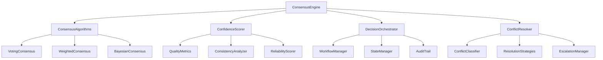

# Multi-Agent Consensus Engine Design

## Overview

The Multi-Agent Consensus Engine provides systematic consensus mechanisms, confidence scoring, and decision orchestration for multi-agent systems. It serves as a foundational service that resolves conflicts between multiple agents or analysis systems without implementing domain-specific logic.

## Architecture

### Core Components



### Data Flow

1. **Input Processing**: Multiple agent analyses are received and validated
2. **Consensus Calculation**: Appropriate consensus algorithms are applied
3. **Confidence Scoring**: Quality and reliability metrics are calculated
4. **Conflict Detection**: Disagreements are identified and classified
5. **Resolution**: Conflicts are resolved or escalated as appropriate
6. **Output Generation**: Final consensus with confidence metrics is provided

## Components and Interfaces

### ConsensusEngine (ReflectiveModule)

The main orchestrator that coordinates all consensus operations.

**Key Methods:**
- `calculate_consensus(analyses: List[AgentAnalysis]) -> ConsensusResult`
- `orchestrate_decision(workflow: DecisionWorkflow) -> DecisionResult`
- `resolve_conflicts(conflicts: List[Conflict]) -> ResolutionResult`

### ConsensusAlgorithms

Implements various consensus mechanisms for different scenarios.

**Algorithms:**
- **Simple Voting**: Majority rule with equal weights
- **Weighted Consensus**: Agent-specific confidence weights
- **Bayesian Consensus**: Probabilistic consensus with uncertainty
- **Threshold Consensus**: Minimum agreement level required

### ConfidenceScorer

Calculates systematic confidence scores based on multiple criteria.

**Scoring Factors:**
- Analysis quality and completeness
- Agent reliability history
- Cross-agent consistency
- Evidence strength
- Uncertainty quantification

### DecisionOrchestrator

Manages complex multi-agent decision workflows.

**Capabilities:**
- Workflow state management
- Agent coordination
- Timeout handling
- Partial result aggregation
- Audit trail maintenance

### ConflictResolver

Identifies and resolves conflicts between agent analyses.

**Resolution Strategies:**
- Automatic resolution for known patterns
- Weighted voting for minor conflicts
- Expert system rules for domain conflicts
- Human escalation for complex cases

## Data Models

### AgentAnalysis

```python
@dataclass
class AgentAnalysis:
    agent_id: str
    analysis_type: str
    result: Any
    confidence: float
    evidence: List[str]
    metadata: Dict[str, Any]
    timestamp: datetime
```

### ConsensusResult

```python
@dataclass
class ConsensusResult:
    consensus_value: Any
    confidence_score: float
    consensus_method: str
    participating_agents: List[str]
    agreement_level: float
    conflicts_resolved: int
    audit_trail: List[str]
```

### DecisionWorkflow

```python
@dataclass
class DecisionWorkflow:
    workflow_id: str
    decision_type: str
    required_agents: List[str]
    timeout_seconds: int
    consensus_threshold: float
    escalation_rules: Dict[str, Any]
```

## Error Handling

### Graceful Degradation

- **Partial Agent Failure**: Continue with available agents if minimum threshold met
- **Algorithm Failure**: Fall back to simpler consensus methods
- **Timeout Handling**: Provide partial results with appropriate confidence reduction
- **Invalid Input**: Sanitize and continue with valid analyses

### Error Recovery

- **State Persistence**: Maintain decision state across failures
- **Retry Mechanisms**: Automatic retry with exponential backoff
- **Audit Preservation**: Ensure audit trails survive system failures
- **Rollback Capability**: Ability to revert to previous consensus states

## Testing Strategy

### Unit Testing

- Individual algorithm correctness
- Confidence scoring accuracy
- Conflict detection precision
- State management reliability

### Integration Testing

- Multi-agent workflow orchestration
- Cross-component communication
- Error handling and recovery
- Performance under load

### Scenario Testing

- Various consensus scenarios (agreement, conflict, partial failure)
- Different agent reliability profiles
- Complex decision workflows
- Edge cases and boundary conditions

### Performance Testing

- Consensus calculation speed (target: <1s for 10 agents)
- Confidence scoring performance (target: <500ms)
- Concurrent operation handling (target: 100+ simultaneous)
- Memory usage and scalability

## Security Considerations

### Input Validation

- Agent identity verification
- Analysis format validation
- Malicious input detection
- Rate limiting and DoS protection

### Audit and Compliance

- Complete decision audit trails
- Tamper-proof logging
- Compliance with decision governance
- Privacy protection for sensitive analyses

### Access Control

- Agent authentication and authorization
- Role-based access to consensus operations
- Secure communication channels
- Audit log access controls

## Deployment Architecture

### Standalone Service

The consensus engine runs as an independent service to avoid dependencies and ensure reliability.

### API Interface

RESTful API with the following endpoints:
- `POST /consensus/calculate` - Calculate consensus from multiple analyses
- `POST /consensus/orchestrate` - Orchestrate complex decision workflows
- `GET /consensus/status/{workflow_id}` - Get workflow status
- `POST /consensus/resolve-conflicts` - Resolve identified conflicts

### Integration Points

- **Beast Mode Framework**: Provides ReflectiveModule compliance
- **Multi-Instance Orchestration**: Coordinates distributed agents
- **Agent Network**: Receives analyses from various agent types
- **Audit Systems**: Logs all consensus decisions and processes

## Scalability and Performance

### Horizontal Scaling

- Stateless consensus calculations
- Distributed workflow management
- Load balancing across instances
- Shared state through external storage

### Optimization Strategies

- Algorithm selection based on scenario
- Caching of frequent consensus patterns
- Parallel processing of independent analyses
- Lazy evaluation of complex calculations

### Monitoring and Metrics

- Consensus accuracy tracking
- Performance metrics collection
- Error rate monitoring
- Agent reliability scoring
- Decision quality assessment

## Future Enhancements

### Machine Learning Integration

- Pattern recognition for conflict types
- Automatic algorithm selection
- Agent reliability prediction
- Consensus quality improvement

### Advanced Algorithms

- Federated learning consensus
- Blockchain-based consensus for high-trust scenarios
- Quantum-resistant consensus mechanisms
- Real-time streaming consensus

### Enhanced Orchestration

- Complex workflow templates
- Dynamic agent discovery
- Adaptive timeout management
- Predictive conflict resolution